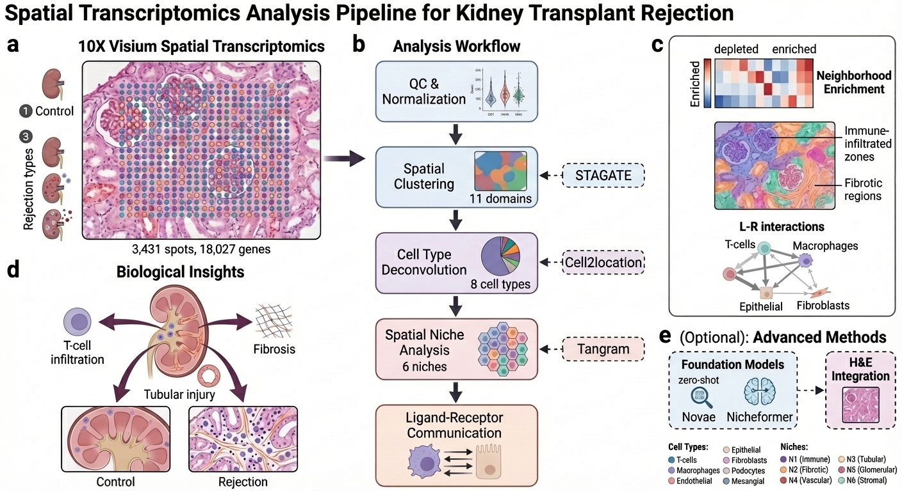
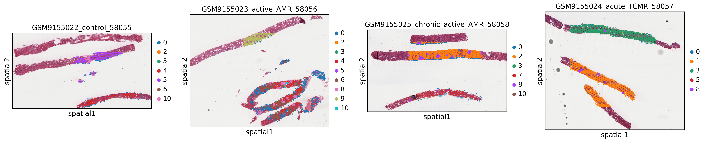
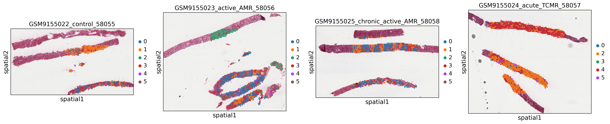
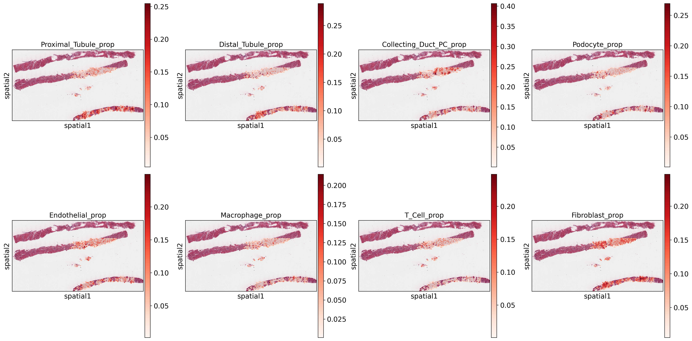
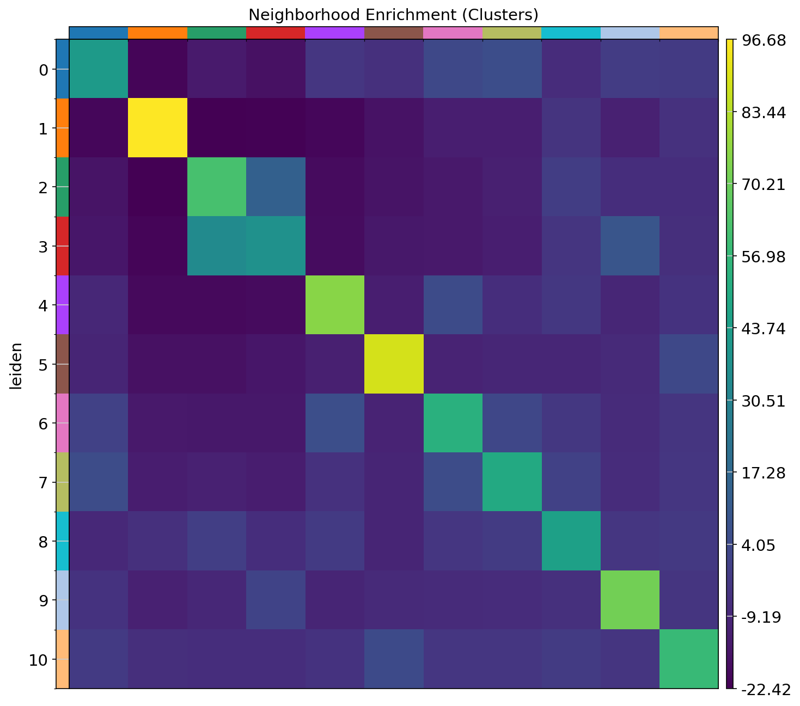
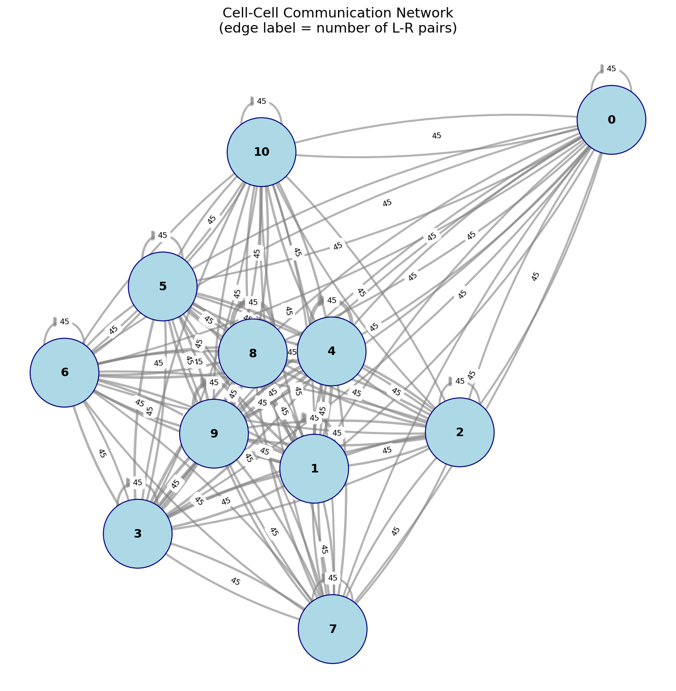
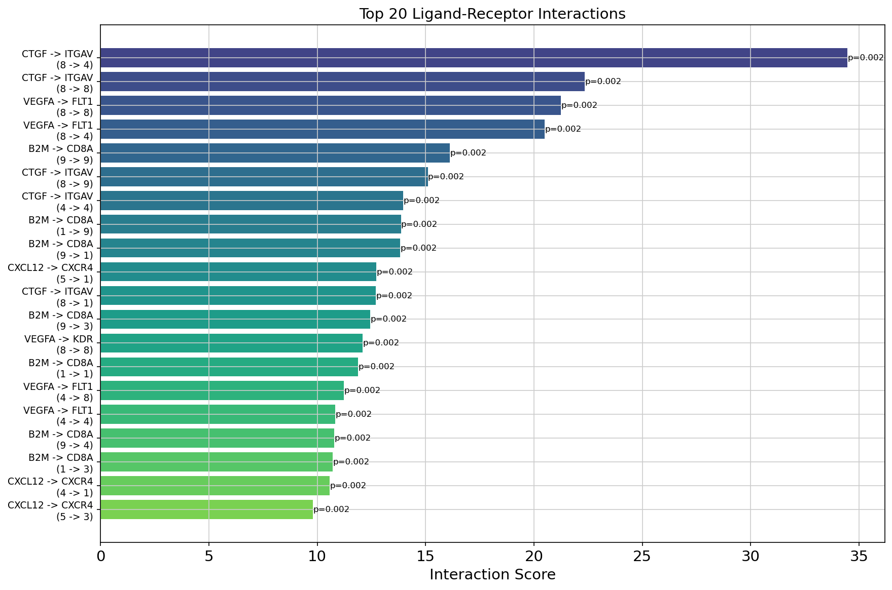

# Spatial Transcriptomics Analysis of Kidney Transplant Rejection

[](https://www.python.org/downloads/)
[](https://opensource.org/licenses/MIT)
[](https://scanpy.readthedocs.io/)
[](https://squidpy.readthedocs.io/)
[](https://www.frontiersin.org/journals/immunology/articles/10.3389/fimmu.2025.1654741/full)

> **Graph-theoretic and permutation-based statistical framework for dissecting immune microenvironments in kidney allograft rejection from 10X Visium data.**

This project extends our [published research in Frontiers in Immunology](https://www.frontiersin.org/journals/immunology/articles/10.3389/fimmu.2025.1654741/full) (Data: [GSE304669](https://www.ncbi.nlm.nih.gov/geo/query/acc.cgi?acc=GSE304669)) with a fully quantitative treatment of spatial neighborhood analysis, cell–cell communication inference, and condition-specific ligand–receptor profiling.

---

## Key Results

| Metric | Value |
|--------|-------|
| **Spots Analyzed** | 3,431 |
| **Genes** | 18,027 |
| **Samples** | 4 (1 Control + 3 Rejection Types) |
| **Spatial Clusters** | 11 |
| **Tissue Niches** | 6 |
| **L-R Pairs Tested** | 50 kidney-relevant pairs |

---

## Analysis Pipeline


*Complete analysis pipeline from data loading through ligand-receptor analysis*

---

## Mathematical Framework

### 1. Data Model

A Visium sample is a tuple $(\mathbf{X}, \mathbf{P})$ where $\mathbf{X} \in \mathbb{N}_0^{n \times G}$ is the UMI count matrix over $n = 3{,}431$ spots and $G = 18{,}027$ genes, and $\mathbf{P} \in \mathbb{R}^{n \times 2}$ holds the spatial centroids. Counts are library-size normalized and log-transformed:

$$\tilde{x}_{ig} = \log\left(1 + 10^{4} \cdot \frac{x_{ig}}{\sum_{g'=1}^{G} x_{ig'}}\right).$$

### 2. Spatial Proximity Graph

Tissue geometry is encoded as an undirected graph

$$\mathcal{G} = (\mathcal{V}, \mathcal{E}), \qquad A_{ij} = \mathbb{1}\left[\  j \in \mathrm{kNN}_k(i)\ \lor\ i \in \mathrm{kNN}_k(j) \ \right],$$

where $A$ is the adjacency matrix and $\mathrm{kNN}_k(i)$ are the $k$ nearest neighbors of spot $i$ under Euclidean distance on $\mathbf{P}$. All spatial statistics below are computed on $\mathcal{G}$.

### 3. Graph-Based Clustering (Leiden)

Spots are partitioned by maximizing modularity on the (expression $\times$ space) neighbor graph at resolution $\gamma$:

$$Q = \frac{1}{2m}\sum_{i,j}\left[ A_{ij} - \gamma \  \frac{k_i k_j}{2m} \right] \delta(c_i, c_j), \qquad k_i = \sum_j A_{ij},\quad m = \tfrac{1}{2}\sum_{i,j} A_{ij},$$

where $c_i$ is the community of spot $i$ and $\delta$ the Kronecker delta. The Leiden algorithm guarantees communities that are *well-connected* (no disconnected sub-communities), unlike Louvain.

### 4. Marker-Based Cell Type Scoring

Each of the 8 kidney cell types $t$ is defined by a marker set $\mathcal{M}_t$. A spot's affinity for type $t$ is the mean of per-gene $z$-scored expression over the marker set:

$$s_i^{(t)} = \frac{1}{|\mathcal{M}_t|}\sum_{g \in \mathcal{M}_t} z_{ig}, \qquad z_{ig} = \frac{\tilde{x}_{ig} - \mu_g}{\sigma_g},$$

with hard assignment $t_i^{*} = \arg\max_{t}\  s_i^{(t)}$.

### 5. Neighborhood Enrichment

For cluster pair $(a, b)$, let $N_{ab}$ be the number of edges in $\mathcal{G}$ connecting a spot of cluster $a$ to one of cluster $b$. Significance is assessed against the null of spatial randomness via label permutation:

$$Z_{ab} = \frac{N_{ab} - \mathbb{E}_{0}[N_{ab}]}{\mathrm{sd}_{0}(N_{ab})},$$

where $\mathbb{E}_0$ and $\mathrm{sd}_0$ are taken over permutations of the cluster labels. $|Z_{ab}| \gg 2$ indicates significant co-localization ($Z > 0$: enrichment; $Z < 0$: avoidance).

### 6. Ligand–Receptor Communication Inference

For a curated ligand–receptor pair $(\ell, r)$ and sender/receiver populations $(\mathcal{S}, \mathcal{R})$ that are spatially adjacent, the interaction score couples mean ligand and receptor expression:

$$S_{\ell r} = \bar{x}_{\ell}^{(\mathcal{S})} \cdot \bar{x}_{r}^{(\mathcal{R})}, \qquad \bar{x}_{g}^{(\mathcal{C})} = \frac{1}{|\mathcal{C}|}\sum_{i \in \mathcal{C}} \tilde{x}_{ig}.$$

**Permutation test** ($B = 500$): cell-type labels are reshuffled 500 times to build a null distribution $\{S^{(b)}\}$ over the statistic, and the exact Monte-Carlo p-value is

$$p = \frac{1 + \sum_{b=1}^{B} \mathbb{1}\left[\  S^{(b)} \geq S_{\text{obs}} \ \right]}{B + 1}.$$

**Condition-specific differential signaling** between rejection and control is quantified as

$$\Delta \log_2 \mathrm{FC}_{\ell r} = \log_2 \frac{S_{\ell r}^{\ \text{rejection}} + \varepsilon}{S_{\ell r}^{\ \text{control}} + \varepsilon}, \qquad \varepsilon \ll 1.$$

### 7. Multiple Testing Correction

Across the $m = 50$ tested pairs, Benjamini–Hochberg controls the false discovery rate: with ordered $p$-values $p_{(1)} \leq \dots \leq p_{(m)}$, reject $H_{0(i)}$ for all $i \leq k^{*} = \max\{ i : p_{(i)} \leq \frac{i}{m} q \}$ at level $q = 0.05$.

---

## Methods Summary

| Analysis | Method | Mathematical Object |
|----------|--------|---------------------|
| **Spatial Clustering** | Leiden + Spatial PCA | Modularity maximization on $\mathcal{G}$ |
| **Cell Type Scoring** | Marker-based | $z$-scored marker means, $\arg\max$ assignment |
| **Niche Identification** | Squidpy | Permutation $Z$-score of graph edge counts |
| **L-R Communication** | Custom permutation | Score $S_{\ell r}$ + exact MC $p$-value ($B = 500$) |
| **Differential Analysis** | Log2FC comparison | $\Delta \log_2 \mathrm{FC}$ rejection vs control |

### Cell Types Analyzed

- **Proximal Tubule** (CUBN, LRP2, SLC34A1)
- **Distal Tubule** (SLC12A3, CALB1)
- **Collecting Duct** (AQP2, AQP3)
- **Endothelial** (PECAM1, VWF, CD34)
- **Immune Cells** (PTPRC, CD68, CD3D)
- **Fibroblasts** (COL1A1, DCN, VIM)
- **Podocytes** (NPHS1, NPHS2, WT1)
- **Mesangial** (PDGFRB, ACTA2)

### Ligand-Receptor Pairs Profiled

Curated kidney-relevant interactions including:
- **Immune signaling**: CCL2-CCR2, CXCL10-CXCR3, TNF-TNFRSF1A
- **Fibrosis**: TGFB1-TGFBR1/2, PDGFB-PDGFRB
- **Complement**: C3-C3AR1, C5-C5AR1
- **Immune checkpoints**: CD274-PDCD1 (PD-L1/PD-1)
- **Antigen presentation**: HLA-A-CD8A, HLA-DRA-CD4

---

## Repository Structure

```
spatial-kidney-rejection/
│
├── notebooks/                    # Analysis notebooks (run sequentially)
│   ├── 01_data_loading_qc.ipynb       # Data loading, QC, normalization
│   ├── 02_spatial_clustering.ipynb    # Leiden clustering, UMAP
│   ├── 03_cell2location_deconv.ipynb  # Cell type scoring
│   ├── 04_spatial_niche_analysis.ipynb # Spatial neighborhoods
│   └── 05_ligand_receptor.ipynb       # L-R communication analysis
│
├── src/                          # Reusable Python modules
│   ├── preprocessing.py               # Data loading & QC functions
│   ├── visualization.py               # Spatial plotting functions
│   └── utils.py                       # Helper functions & sample info
│
├── config/                       # Configuration files
│   ├── analysis_params.yaml           # Analysis parameters
│   └── paths.yaml                     # Data paths
│
├── results/                      # Analysis outputs
│   ├── figures/                       # Generated visualizations
│   └── tables/                        # CSV results
│
├── environment.yml               # Conda environment
├── requirements.txt              # Pip dependencies
└── README.md
```

---

## Sample Visualizations

### Spatial Clustering

*Leiden clusters mapped to tissue coordinates across all samples*

### Spatial Niches

*Tissue microenvironment niches identified across samples*

### Cell Type Distribution

*Marker-based cell type scoring showing spatial distribution*

### Neighborhood Enrichment

*Cell type co-localization patterns in the tissue microenvironment*

### L-R Communication Network

*Cell-cell communication network based on ligand-receptor interactions*

### Top Ligand-Receptor Interactions

*Ranked ligand-receptor interactions by interaction score*

---

## Quick Start

### 1. Clone Repository
```bash
git clone https://github.com/xqiu625/spatial-kidney-rejection.git
cd spatial-kidney-rejection
```

### 2. Create Environment
```bash
# Using conda/mamba
mamba env create -f environment.yml
conda activate spatial-kidney

# Or using pip
pip install -r requirements.txt
```

### 3. Download Data
```bash
# Data from GEO: GSE304669
# See notebooks/01_data_loading_qc.ipynb for download instructions
```

### 4. Run Analysis
```bash
# Launch Jupyter
jupyter notebook

# Run notebooks 01-05 sequentially
```

---

## Key Findings

### Spatial Niches in Rejection

The analysis identified **6 distinct tissue niches** with differential cell type compositions between control and rejection samples:

1. **Tubular-dominant niches** - Proximal/distal tubule enriched
2. **Immune-infiltrated zones** - High immune cell density in rejection
3. **Fibrotic regions** - Fibroblast accumulation in chronic rejection
4. **Vascular niches** - Endothelial-rich areas
5. **Mixed cellular regions** - Transitional zones
6. **Glomerular regions** - Podocyte and mesangial enriched

### Differential L-R Communication

Comparing rejection vs control samples revealed:
- **Upregulated in rejection**: Inflammatory chemokine signaling (CXCL9/10-CXCR3)
- **Immune checkpoint changes**: Altered PD-L1/PD-1 axis
- **Fibrotic signaling**: Enhanced TGF-β pathway activity

---

## Technologies & Skills

| Category | Technologies |
|----------|-------------|
| **Languages** | Python 3.10+, R |
| **Spatial Analysis** | Scanpy, Squidpy, AnnData |
| **Visualization** | Matplotlib, Seaborn, NetworkX |
| **Statistics** | Permutation testing, Multiple testing correction |
| **Data Formats** | 10X Visium, H5AD, MTX |
| **Environment** | Conda, Jupyter, HPC (SLURM) |

---

## Data Source & Citation

- **Publication**: [Frontiers in Immunology (2025)](https://www.frontiersin.org/journals/immunology/articles/10.3389/fimmu.2025.1654741/full)
- **GEO Accession**: [GSE304669](https://www.ncbi.nlm.nih.gov/geo/query/acc.cgi?acc=GSE304669)
- **Platform**: 10X Genomics Visium FFPE
- **Tissue**: Human kidney transplant biopsies
- **Conditions**: Control (n=1), Active AMR (n=1), Acute TCMR (n=1), Chronic Active AMR (n=1)

---

## Future Directions

- [ ] Integration with reference scRNA-seq for probabilistic deconvolution (Cell2location)
- [ ] Spatial-aware clustering with BayesSpace
- [ ] Trajectory analysis of rejection progression
- [ ] Deep learning-based spatial pattern recognition

---

## Author

**Xinru Qiu**
Computational Biology | Spatial Transcriptomics | Machine Learning

---

## License

This project is licensed under the MIT License - see the [LICENSE](LICENSE) file for details.

---

## Acknowledgments

- Original data from kidney transplant rejection study (GSE304669)
- Scanpy and Squidpy development teams
- 10X Genomics for Visium technology
